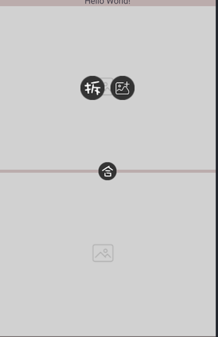
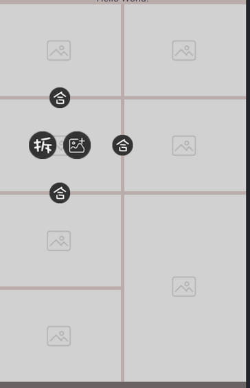
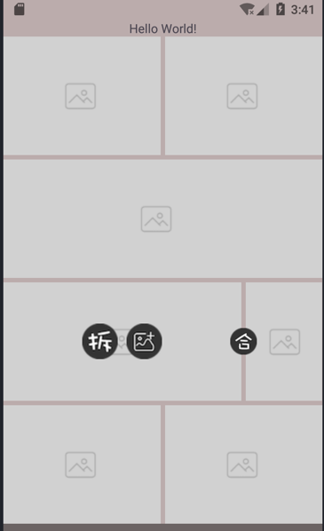
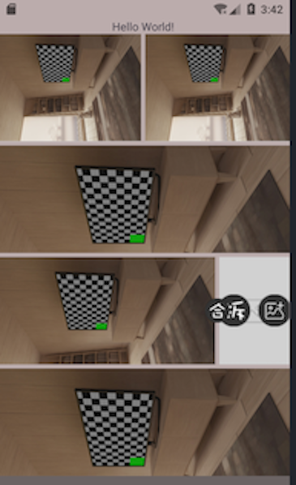

# IrregularLayoutView

`IrregularLayoutView` 是一个 Android 自定义控件模块，用于实现矩形布局 切割－捏合 并选择相册图片填充，缩放。用途，创建自定义moka

## 功能特点

- 支持自定义不规则布局
- 提供灵活的布局参数配置





## 版本

version: 1.0.3
## 安装

1. 在 `settings.gradle.kts` 中添加仓库：
    ```
    repositories {
        maven {
            url = uri("https://maven.pkg.github.com/dyshandy/IrregularLayoutView")
        }
    }
    ```
2. 在 `build.gradle.kts` 中添加依赖：
    ```
    dependencies {
        implementation("org.duanyu:irregularlayoutview:1.0.3")
    }
    ```

## 使用方法

1. 在 `XML` 中使用
    ```
    <org.duanyu.irregularlayoutview.IrregularLayoutView
    android:layout_width="match_parent"
    android:layout_height="match_parent"/>
    ```
2. 在代码中使用
    ```
    IrregularLayoutView irregularLayoutView = findViewById(R.id.irregularLayoutView);
    ```
